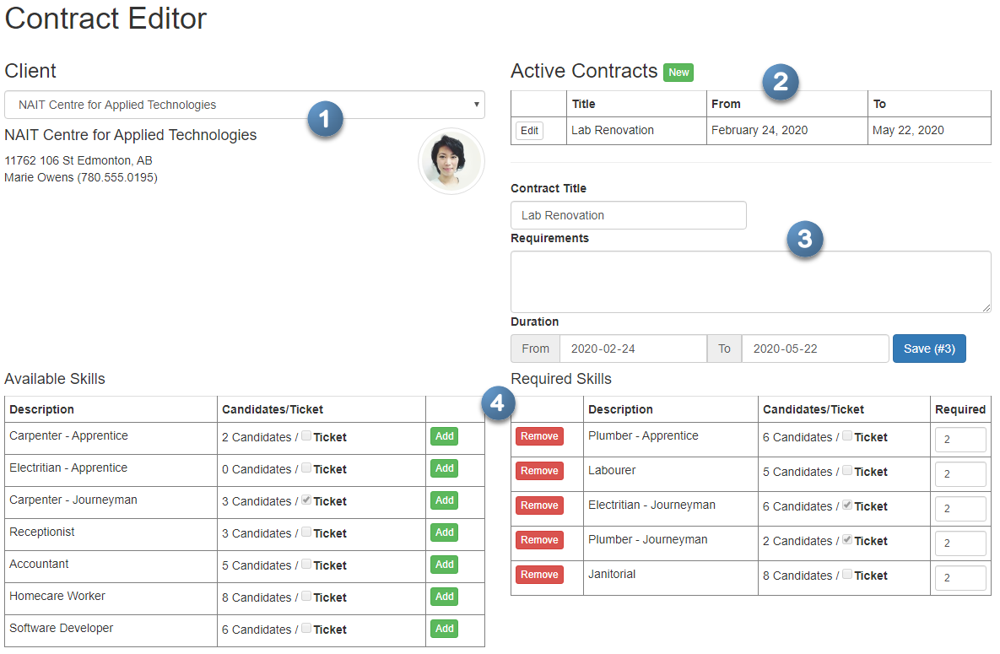
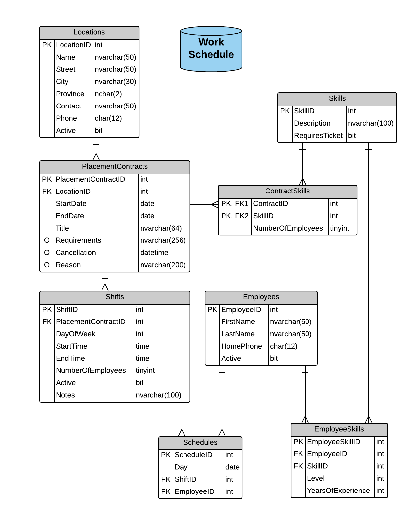
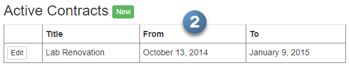
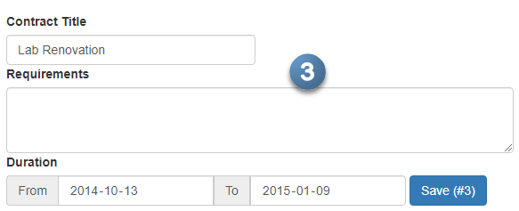
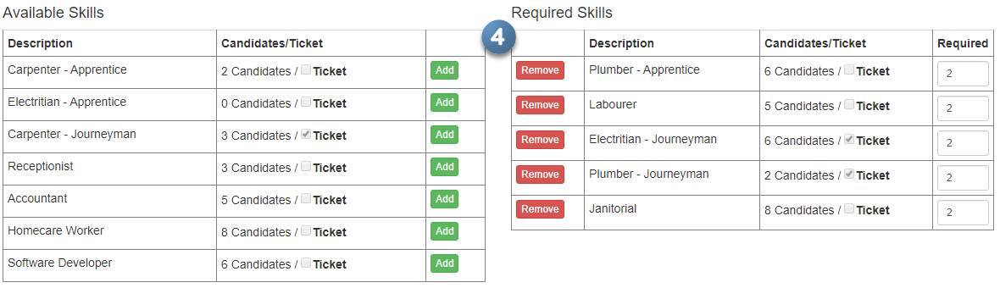

# Contract Editor Series (**8 Marks**)

In this exercise, you will build a page to act as an editor for new and existing Placement Contracts in the Work Schedule database. This page and its supporting back-end systems will be built in various phases. The following image represents the final appearance of the page (as shown in the middle of editing a current contract).



This exercise is designed to guide you through an iterative development approach in which to build this web page. Each phase will be evaluated independently, and will build on previous phases.

> **Note:** This exercise uses the latest version of the WorkSchedule database, which includes additional tables and updated columns which are necessary for this exercise. There are also a number of related images for client contacts at each location.
>
> As such, you have been supplied a Visual Studio solution as a starter kit for this exercise. The code currently supplied is functional as-is and need not be changed unless commented as such in the code. In the solution, the DAL and Entity classes must be edited to be `internal` classes. All communication between the BLL and Presentation Layers must be via View Models and/or primitive data types. View Models have been provided for you for this assignment.
>
> 

----

## Marking Summary

| Phase         | Possible |  Earned  |
|:--------------|:--------:|:--------:|
| **0** - Setup |   *0*    | **-**  |
| **1** - Setup |   *0*    | **-**  |
| **2** - Setup |   *1*    | **TBA**  |
| **3** - Setup |   *2*    | **TBA**  |
| **4** - Setup |   *4*    | **TBA**  |
| **5** - Setup |   *5*    | **TBA**  |
| ------------- | -------- | -------- |
| **TOTAL**     |   *12*   | **TBA**  |

### Generalized Marking Rubric

| Weight | Breakdown |
| ---- | --------- |
| **1** | 1 = **Proficient** (requirement is met)<br />0 = **Incomplete** (requirement not met) |
| **2** | 2 = **Proficient** (requirement is met)<br />1 = **Limited** (requirement is poorly met, minor errors)<br />0 = **Incomplete** (requirement not met, missing large portions) |
| **3** | 3 = **Proficient** (requirement is met)<br />2 = **Capable** (requirement is adequately met, minor errors)<br />1 = **Limited** (requirement is poorly met, major errors)<br />0 = **Incomplete** (requirement not met, missing large portions) |
| **4** | 4 = **Proficient** (requirement is met)<br />3 = **Capable** (requirement is adequately met, minor errors)<br />2 = **Acceptable** (requirement is partially met, minor errors)<br />1 = **Limited** (requirement is poorly met, major errors)<br />0 = **Incomplete** (requirement not met, missing large portions) |
| **5** | 5 = **Proficient** (requirement is fully met)<br />4 = **Capable** (requirement is adequately met, minor errors)<br />3 = **Acceptable** (requirement is partially met, minor errors)<br />2 = **Sub-Par** (requirement is partially met, significant errors)<br />1 = **Limited** (requirement is poorly met, major errors)<br />0 = **Incomplete** (requirement not met, missing large portions) |

----

## Phase 0 - Page Setup (Weight: 0)

> This step has been **performed for you already** in your starter kit. These instructions are here as an example of directions for a phase of the overall development of this *Integration* exercise.

On the initial `GET` request for the page, a minimal set of controls are allowed to be visible to the user. These include a Drop-Down for selecting the client location and an "empty" placeholder image for the contact person. Use the built-in ASP.Net controls for these items. Apply appropriate Bootstrap styles to these controls.


The layout of the page should be such that there are three rows of content. The first row must hold the page title and the `MessageUserControl` in a `col-md-12` row. The second row contains two `col-md-6` sections, the first holding the information on the Client selection and the second holding information on the Active Contracts for the client. The final row is also to be made up of two `col-md-6` sections, one for showing available skills and the other for showing required skills.

Some other useful Bootstrap styles for this portion include `form-control`, `pull-right`, `img-circle`, `img-thumbnail`.

----

## Phase 1 - Lookup Client Location (Weight: 0)

> This step has been **performed for you already** in your starter kit. These instructions are here as an example of directions for a phase of the overall development of this *Integration* exercise.


For this phase, you are to populate the Drop-Down with the client locations. Display the name of the location in the drop-down, and ensure that the control performs an automatic post-back when the selection changes. In response to the post-back, you are to display the detailed information on the client location and client contact.

If the user selects the prompting text (the first option in the drop-down), then these controls should be cleared.

The following images can be used as photos for the client contacts.

    

----

## Phase 2 - Selected Client's Contracts (Weight: 1)



The selection of a client from the previous phase should, in this phase, trigger the population of a GridView to list the active contracts for the client. An active contract is one whose End Date is in the future. Note also that it should trigger the visibility of a button for creating a new contract. As in the previous phase, when the user selects the prompting text of the drop-down, these controls should be cleared/hidden. You can use the `table` and `table-hover` styles on the GridView.

----

## Phase 3 - Placement Contract Details (Weight: 2)



This phase of the development is concerned with allowing the user to edit/create a placement contract. When the user clicks the ***Edit*** button in the GridView, the form should show the existing information on the selected contract and the ***Save*** button's text should include the ID of that placement contract.

When the user clicks the ***New*** button, the controls are to be cleared of their contents, and the ***Save*** button's text should show that they are working on a new contract.


> ***Note:** Do **not** implement the code-behind functionality of the* **Save** *button; this is to be completed in the final phase of this exercise set.*

For the *Duration* form controls, you can use the following Bootstrap-styled code to display the *From* and *To* dates as a single in-line form.

<!-- Bootstrap 3
``xml
<div class="form-inline">
    <div class="form-group">
        <div class="input-group">
            <div class="input-group-addon">From</div>
            <asp:TextBox ID="FromDate" runat="server"
                CssClass="form-control" TextMode="Date" />
            <div class="input-group-addon">To</div>
            <asp:TextBox ID="ToDate" runat="server"
                CssClass="form-control" TextMode="Date" />
        </div>
    </div>
    <asp:LinkButton ID="SaveContract" runat="server"
        CssClass="btn btn-primary">Save</asp:LinkButton>
</div>
``
-->

<!-- Bootstrap 4 -->

```xml
<div class="form-inline">
    <div class="form-group row">
        <div class="input-group">
            <div class="input-group-prepend">
                <span class="input-group-text">From</span>
            </div>
            <asp:TextBox ID="FromDate" runat="server" CssClass="form-control" TextMode="Date" />
            <div class="input-group-append">
                <div class="input-group-prepend">
                    <span class="input-group-text">To</span>
                </div>
                <asp:TextBox ID="ToDate" runat="server" CssClass="form-control" TextMode="Date" />
            </div>
        </div>
        &nbsp;&nbsp;
        <asp:LinkButton ID="SaveContract" runat="server" CssClass="btn btn-primary" OnClick="SaveContract_Click">Save</asp:LinkButton>
    </div>
</div>
```

When setting the values of the date textboxes, use the following string formatting pattern to correctly display the information:

```csharp
.ToString("yyyy-MM-dd")
```

----

## Phase 4 - Contract Skills (Weight: 4)



In this phase of building the Contract Editor, you are to enable the user to add or remove skills from the placement contract. These actions must ***not*** modify the database. Rather, you are to maintain the information and perform the add/remove actions directly in the controls used to display the data. Also, when the user clicks **Add**, default the required quantity to `0` for the newly added skill.

The initial population of the Available and Required controls must be based on whether the user is editing an existing contract or creating a new contract. In the case of a new contract, the Available Skills control must list all the skills and the Required Skills control must be empty. In the case of an existing contract, the Required Skills control must be populated with the skills for that contract and the Available Skills control must list all the skills not in the contract.

Note also that a change in the Client Location drop-down must cause these controls to empty their respective lists of skills.

> **Tip:** While the data for the two lists differ only in that the Required Skills has input for the number of people required with that skill, you can use the same underlying POCO for both lists.

> **Tip:** You are encouraged to use GridView controls for these two lists. The GridViews can use the `Select` value for the `CommandName` of the `<asp:ButtonField>` columns. For the **Required** column, you can use the following styling.
>
> ```xml
> <asp:TemplateField HeaderText="Required"
>     ItemStyle-CssClass="col-md-1">
>     <ItemTemplate>
>         <asp:TextBox ID="Required" runat="server"
>             Text="<%# Item.Required %>"
>             CssClass="form-control input-sm"
>             TextMode="Number" /> >
>     </ItemTemplate>
> </asp:TemplateField>
> ```

----

## Phase 5 - Save Contract Transaction (Weight: 5)

In the final phase of developing the Contract Editor page, the data from the form must be gathered and sent to the BLL for processing **as a *single* transaction**. The BLL must validate the user's input and **report all errors in a *single* `BusinessRuleException`** (rather than throwing individual exceptions for each error).

### Validation

Whether this is a new or existing contract, the following validation must be performed.

- Contract Title is required and must be at least five characters long
- The From/To dates must be in the correct order chronologically
- The To (contract ending date) date must be in the future
- For each supplied Skill
  - The skill must exist in the `Skills` table
  - Required number of people for each skill is greater than zero and less than five

If this is a new contract, then these validation rules must be applied
- From date cannot be in the past
- LocationID must exist in the `Locations` table

If this is an existing contract, then these validation rules must be applied
- The LocationID matches the one in the existing `PlacementContract`
- All edits are to be rejected if the placement contract has been cancelled (i.e.: the `Cancellation` date exists for the contract)

> Remember, use a `BusinessRuleExcepton` to gather all errors/problems in the submission, so that they are sent back as a group. 

### Data Processing

For new contracts, insert a new `PlacementContract` with all the skills that were identified for the contract.

For existing contracts, only the start/end dates and the title/requirements can be modified on the `PlacementContract`. **Replace** the existing list of contract skills with the new list of skills that were identified for the contract.

> Remember, the data must be processed as a single transaction.
